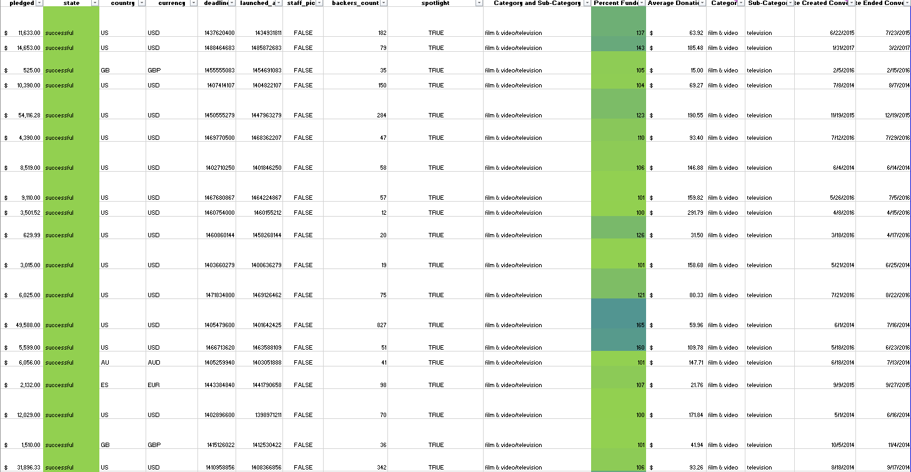
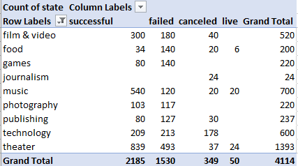
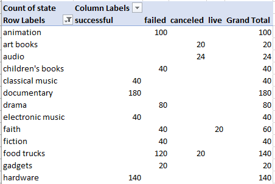
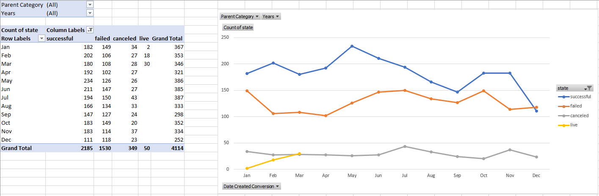
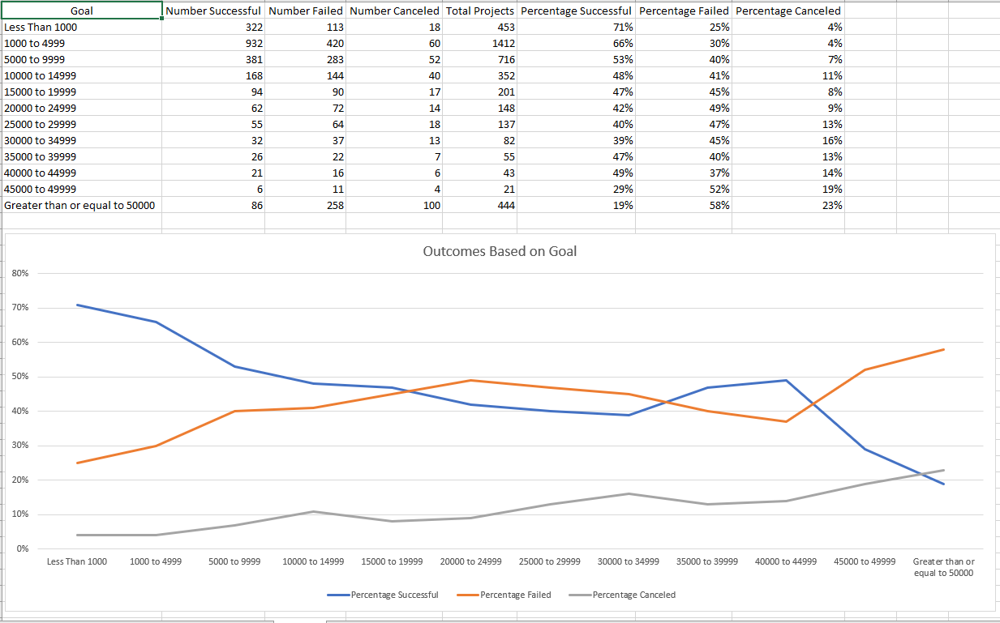
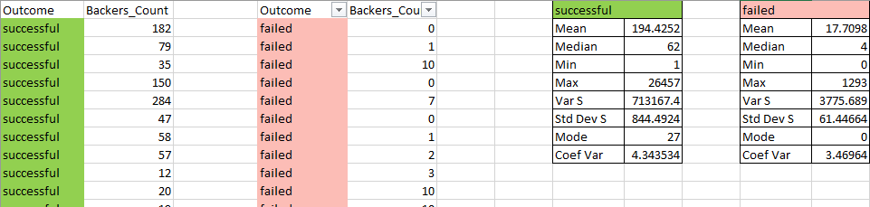

# Excel Homework: Kickstart My Chart

  

## Background

Over $2 billion has been raised using the massively successful crowdfunding service, Kickstarter, but not every project has found success. Of the more than 300,000 projects launched on Kickstarter, only a third have made it through the funding process with a positive outcome.

Getting funded on Kickstarter requires meeting or exceeding the project's initial goal, so many organizations spend months looking through past projects in an attempt to discover some trick for finding success. For this week's homework, you will organize and analyze a database of 4,000 past projects in order to uncover any hidden trends.

## [Excel Report](StarterBookHW.xlsx)

---
A quick example of what the data sheet looks like after adding some calculation columns in and conditional formatting color coding on some other rows.

---
First pivot table showing category totals and whether or not they failed their campaigns. 

---
This pivot table takes all subcategories into consideration while looking at totals of failed and successful campaigns.

---
This is another view on the same metrics as the other pivot tables. It is a time series showing when campaigns succeeded or failed and what month that took place in.

## Bonus and [Analysis](StarterBookHW.docx)

Included are images of the final visual for this report and includes a standard statistical analysis table. Attached in a word document is the overall analysis for this report.
